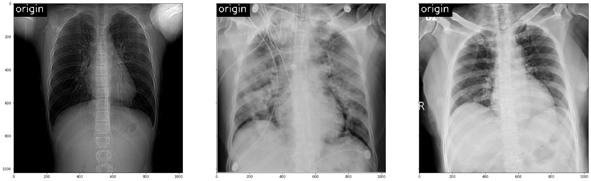
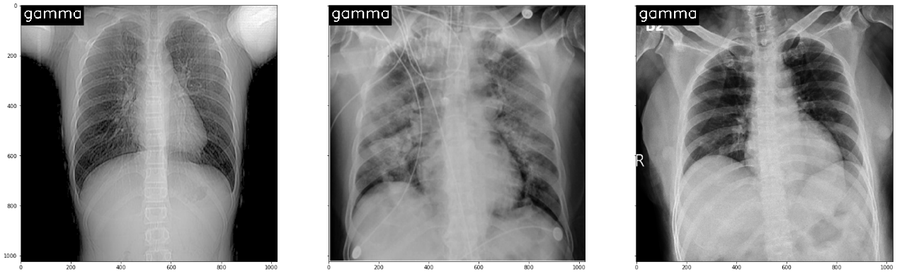
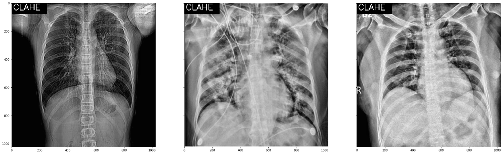
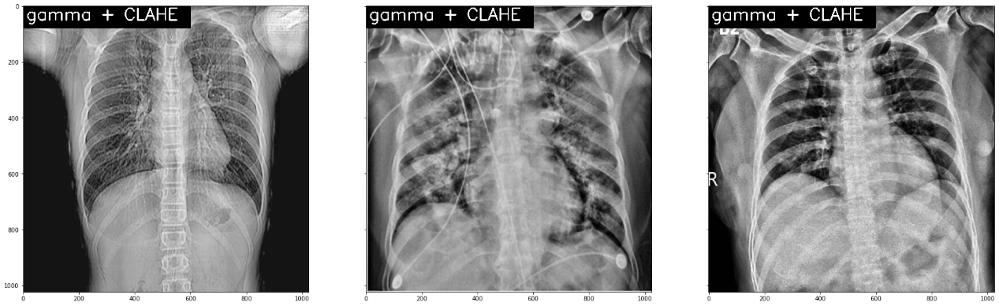
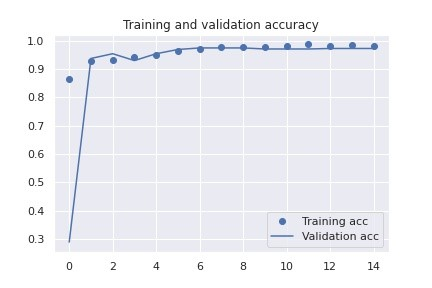
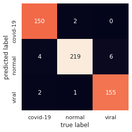
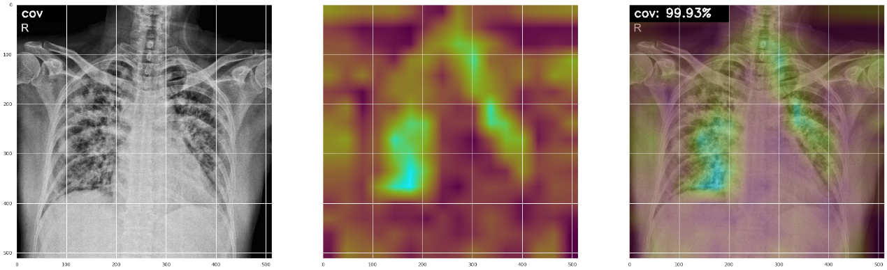

# COVID-19 CT Detection

### Overview

Pretrained (imagenet) ResNet50 with 3 classification. Achieves `97.2%` test accuracy. Use Grad-CAM for infected area segmentation.

### Image Enhancement
Gamma transform and CLAHE

### Datasets:
[1][Chowdhury](https://www.kaggle.com/tawsifurrahman/covid19-radiography-database)
[2][IEEE](https://github.com/ieee8023/covid-chestxray-dataset)

### Train-Validation Split
|| COVID-19 | Viral Pneumonia | Normal |
|---| ------ | ------ | ------ |
|Total| 756 | 1361 | 1422 |
|Train| 600 | 1200 | 1200 |
|Test | 156 |161   | 222 |

### Train Accuracy

### Confusion Matrix

### Heatmap for Infected Area

